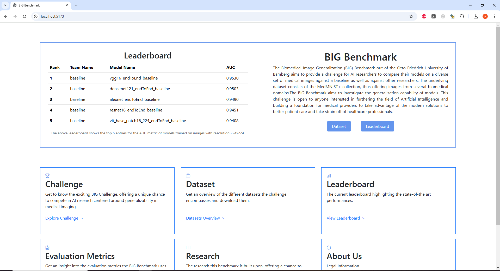

# Masterarbeit
The Thesis to the Code can be found here(Link will be added when available). While the Website can be found here (Link will be added when Website is online). 
## make_medmnist_c.py
Using this file, the corruptions from MedMNIST-C can be effortlessly generated and stored for every resolution, including 28x28, 64x64, 128x128, and 224x224.
## evaluate_multi_head_corrupted_website.py
This file shows how a .csv in the right format, that is needed for the submission at the website, can be greated. This is for submissions for the corrupted Version MedMNIST-C.
The submiossions have 4 columns: 
- **`dataset_name`**: Name of the dataset + the applied corruption + severity. So for bloodMNIST, corruption "pixelate" and severity 0, the dataset_name column would be: "bloodmnistpixealte0".
- **`prediction`**: The predicted value for one image
- **`truth`**: The true value of the image
- **`probability`**: The probabilis of all classes of the image

  
The same for submissions for MedMNIST+ can be found [here](https://github.com/mariusbachmeier/Bachelor-Thesis/blob/main/model-training/test.py).

## Code Structure for mm-PT
The interaction between the code files in the mm-PT directory is structured to ensure modularity and clarity. While most files are interdependent, an essential separation exists between training and testing processes. During training, the focus is on producing training metrics and validation metrics for the models. Notably, no evaluation on the test set is conducted during this phase. The best model and the corresponding heads are saved for evaluation later.

The following files collaborate to ensure an efficient and seamless training pipeline:
- **`mm-pt_config.yaml`**: Configuration file specifying training parameters and settings.  
- **`main.py`**: Entry point for running the training process.  
- **`model_n_data.py`**: Handles dataset loading and preprocessing.  
- **`multi_head_multi_domain_pt.py`**: Implements multi-head and multi-domain training logic.  
- **`multi_head_multi_domain_pt_gradient_accumulation.py`**: Extends multi-head and multi-domain training logic with gradient accumulation.  
- **`backbones.py`**: Contains backbone architecture definitions used.  
- **`utils.py`**: Provides utility functions to support the training process.

For training, the core logic resides in multi_head_multi_domain_pt.py. This file implements the sampling procedure central to the multi-domain, multi-task training paradigm outlined by Woerner et al. (2024).

For testing there are 2 files: 
- **`evaluate_multi_head.py`**: Evaluates trained models on the test set of MedMNIST+.  
- **`evaluate_multi_head_corrupted.py`**: Evaluates trained models on the corresponding test set of MedMNIST-C.

## Code Structure for mm-PT aug
The code structure is the same for mm-PT aug in comparision with mm-PT. Following modifications where made

- **`model_n_data.py`**: Added data augmentation to breastmnist and retinamnist
- **`multi_head_multi_domain_pt.py`**: Modified the logic that the model sees every dataset the same number of times
- **`multi_head_multi_domain_pt_gradient_accumulation.py`**: Modified the logic that the model sees every dataset the same number of times

Testing is the same to mm-PT.

## Code Structure for pre-trained-training
- **`config.yaml`**: Configuration file specifying training parameters and settings.  
- **`feature_extraction.py`**: Extracts the features from the underlying backbones so only the heads can be trained by using the image embeddings
- **`evaluate_with_embeddings_*.py`**: Every file trains 12 heads for the 12 datasets of MedMNIST+ using a different classifier (* = kNN,  lightGBM, Random Forest and SVM), saves the models and evaluates the models and saves the metrics.
- **`train_linear_with_embeddings.py`**: Trains 12 heads for the 12 datasets of MedMNIST+ using a linear classifier and saves the models.
- **`evaluate_with_embeddings_linear.py`**: Evaluates the trained models on train, validation and test, set.
- **`evaluate_mutli_head_corrupted_*.py`**: Evaluates the trained and saved heads on the corrupted MedMNIST-C.

The work and the code is based on the work of [Sebastian Dörrich](https://github.com/sdoerrich97/rethinking-model-prototyping-MedMNISTPlus) and [Francesco di Salvo](https://github.com/francescodisalvo05/medmnistc-api) and their respective papers: [Rethinking Model Prototyping through the MedMNIST+ Dataset Collection](https://arxiv.org/abs/2404.15786) and [MedMNIST-C: Comprehensive benchmark and improved classifier robustness by simulating realistic image corruptions](https://arxiv.org/abs/2406.17536).

Cited sources:
Woerner, S., Jaques, A., & Baumgartner, C.F. (2024). A comprehensive and easy-to-use multi-domain multi-task medical imaging meta-dataset (MedIMeta). ArXiv, abs/2404.16000.
Di Salvo, F., Doerrich, S., & Ledig, C. (2024). MedMNIST-C: Comprehensive benchmark and improved classifier robustness by simulating realistic image corruptions. ArXiv, abs/2406.17536.

## Website

A deeper description for the Website can be found [here](https://github.com/mariusbachmeier/Bachelor-Thesis) from Marius Ludwig Bachmeier, who programmed the core structure of the Website. 
Changes to the Website(front- and backend) and the database were made to make it possible to evaluate and compare models also on the MedMNIST-C dataset from Di Salvo et al. (2024).

The homescreen displays a leaderboard excerpt for the challenge, provides a brief description of the benchmark, and includes navigation to key pages. 

The website offers a seamless user experience with key sections including a dynamic landing page, detailed descriptions of the datasets and challenges, an interactive leaderboard, a dedicated research hub, an engaging "About Us" page, personalized profile management, and the ability to create an account or log in with ease. As a benchmark platform, it also provides the functionality to upload submissions, allowing users to secure their spot on the leaderboard.

The leaderboard page displays an overview of the top 10 submissions, filtered by an evaluation metric and the image resolution used during training. Data is retrieved from the database and passed from the back end to the front end for display.

An additional filter, highlighted with a red border, allows users to select the dataset (MedMNIST+ or MedMNIST-C). This functionality is consistent across the website, enabling dataset selection in various sections, such as the dataset explanations and the submission upload page, where users must specify the dataset for which they are submitting metrics.

The whole Website can be accessed here: (Add link when online)

Cited sources:
Woerner, S., Jaques, A., & Baumgartner, C.F. (2024). A comprehensive and easy-to-use multi-domain multi-task medical imaging meta-dataset (MedIMeta). ArXiv, abs/2404.16000.
Di Salvo, F., Doerrich, S., & Ledig, C. (2024). MedMNIST-C: Comprehensive benchmark and improved classifier robustness by simulating realistic image corruptions. ArXiv, abs/2406.17536.

